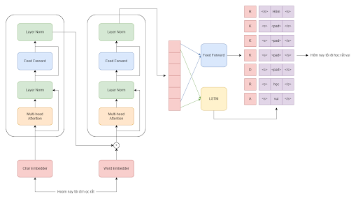

# SSTG

This is a repo for Semi Autoregressive Tagger for Vietnamese Spelling Correction

<p align="center">
  
</p>
<p align="center">
  <b>Figure:</b> Semi Autoregressive Tagger 
</p>

[Reference Paper](https://arxiv.org/pdf/2008.01474.pdf)
## Installation

```bash
python -m pip install -r requirements.txt
```

## Usage

- Download dataset and word-char tokenizer
```sh
mkdir dataset
mkdir pretrained
mkdir checkpoint

cd dataset
gdown https://drive.google.com/uc?id=15mb-zdKFz8iGAXI3QD3yzHPqmI2hHIr2
gdown https://drive.google.com/uc?id=15r0IOnEM0T7GKaOPXA3dYSJ8VRI2G3L3

cd ../pretrained
gdown https://drive.google.com/uc?id=15zigZy0Or3NIPB42fp7kpzzK_mPhKzZS
gdown https://drive.google.com/uc?id=164es5wH2vNsCkpucSuEGsGcKwAFYow7K
gdown https://drive.google.com/uc?id=168NrylathiaEPRwS-9qk8WEJY7vVbDra
```

- Train
```python
python train.py
```
## Contributing
Pull requests are welcome. For major changes, please open an issue first to discuss what you would like to change.

Please make sure to update tests as appropriate.

## License
[MIT](https://choosealicense.com/licenses/mit/)